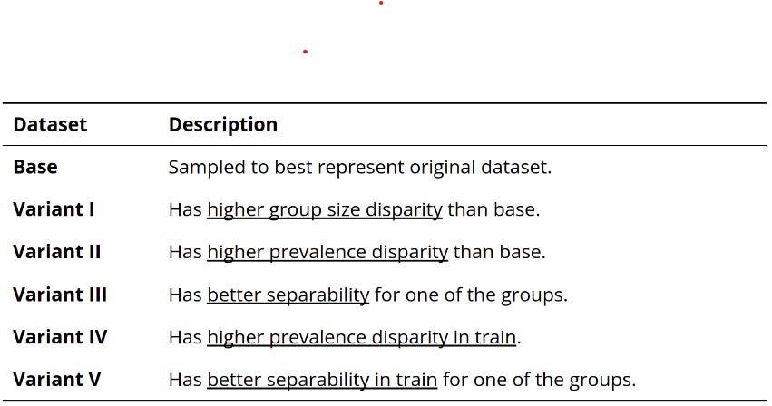

# Project
IntelliFraud: Bank Account Fraud Detection

## Goal
Goal of this application is to detect fraudulent bank account getting opened through online applications in a consumer bank. 
 - This project demonstrates the use of graph network to analyze any fraudelent transaction pattern in the data.
 - Additionally, this project explores the possibility of getting better predictions thru voting and stacking classifiers comparing with LightGBM, XGBoost and AdaBoost.

## Data 
=============================
For our project, we referenced the Kaggle competition  Bank Account Fraud Dataset Suite (NeurIPS 2022)  [ https://www.kaggle.com/datasets/sgpjesus/bank-account-fraud-dataset-neurips-2022 ] that provided 6 datasets which are highly imbalaced.

## DESCRIPTION
==============================

## INSTALLATION
==============================

## EXECUTION
==============================
* docker build --no-cache -t intellifraud .
* docker run -p 8082:8501 intellifraud 
* localhost:8082

