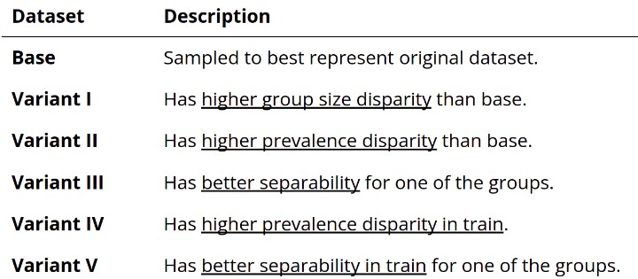

# Project
IntelliFraud: Bank Account Fraud Detection

## Goal
Goal of this application is to detect fraudulent bank account getting opened through online applications in a consumer bank. 
 - This project demonstrates the use of graph network to analyze any fraudelent transaction pattern in the data.
 - Additionally, this project explores the possibility of getting better predictions thru voting and stacking classifiers comparing with LightGBM, XGBoost and AdaBoost.

## Data 
For our project, we referenced the Kaggle competition  Bank Account Fraud Dataset Suite (NeurIPS 2022)  [ https://www.kaggle.com/datasets/sgpjesus/bank-account-fraud-dataset-neurips-2022 ] that provided 6 datasets which are highly imbalaced.

## DESCRIPTION

## INSTALLATION
1. Clone the repository from github.
2. Create a virtual environment called intellifraud -  [ https://code.visualstudio.com/docs/python/environments ]
3. Install all required packages from requirements.txt - [`pip install -r requirements.txt`]
4. Create a folder called "data" at the same directory level as app.py.
5. Copy the following datasets from Kaggle:
    /kaggle/input/bank-account-fraud-dataset-neurips-2022/Base.csv
    /kaggle/input/bank-account-fraud-dataset-neurips-2022/Variant I.csv
    /kaggle/input/bank-account-fraud-dataset-neurips-2022/Variant II.csv
    /kaggle/input/bank-account-fraud-dataset-neurips-2022/Variant III.csv
    /kaggle/input/bank-account-fraud-dataset-neurips-2022/Variant IV.csv
    /kaggle/input/bank-account-fraud-dataset-neurips-2022/Variant V.csv

## EXECUTION
1. Without docker - `streamlit run app.py` . Application will open at localhost:8501 automatically.
2. With docker, run the following commands to create the image/container and run from docker
    * `docker build --no-cache -t intellifraud` .
    * `docker run -p 8082:8501 intellifraud`
    * On the browser type `localhost:8082`

